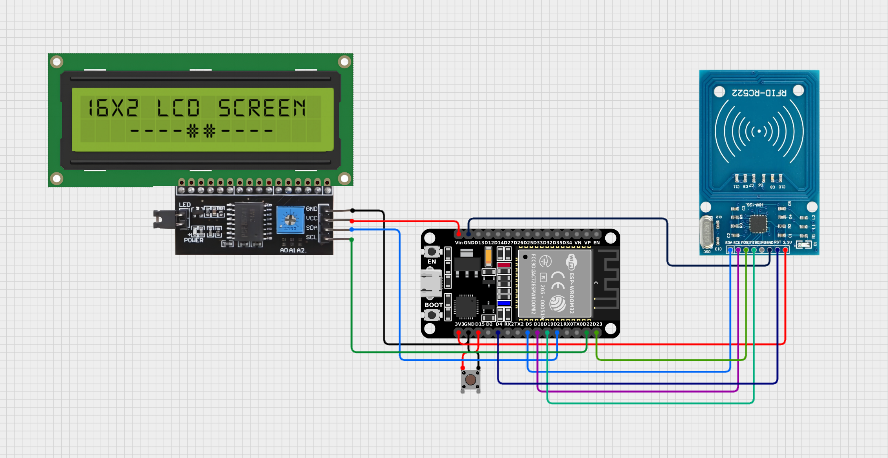
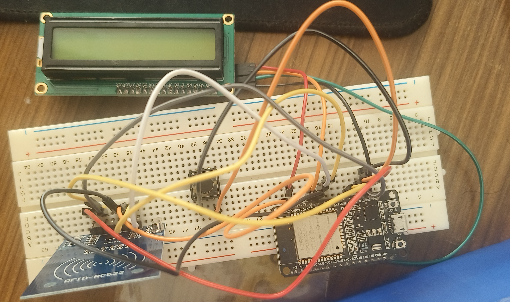

# ESP32 RFID Attendance System

A simple RFID attendance system built with an ESP32, MFRC522 reader, 16×2 I2C LCD and Google Sheets.

The idea is straightforward: scan an RFID card, let the ESP32 identify the card, send the UID through Wi-Fi, and let Google Sheets keep the attendance record. A push button is used to switch between **Attendance** and **Registration** modes.

## What this project does

- Reads RFID cards/keychains using an MFRC522.
- Shows status and results on a 16×2 I2C LCD.
- Connects the ESP32 to Wi-Fi.
- Registers new RFID UIDs.
- Records Time In and Time Out.
- Uses Google Apps Script as the bridge between the ESP32 and Google Sheets.
- Keeps separate user and attendance sheets.
- Prevents the same UID from being registered twice.
- Prevents a second completed attendance record for the same user on the same day.

## Hardware

- ESP32 development board
- MFRC522 RFID-RC522 module
- 16×2 LCD with I2C backpack
- Push button
- RFID card/keychain
- Jumper wires
- USB cable/power supply

See the wiring details in [`docs/03-wiring.md`](docs/03-wiring.md).

## Project Images

### Circuit Diagram



### Prototype




### Final Project- Top View


### Final Project- Side View


## How the system works

### Attendance

1. The ESP32 starts in Attendance mode.
2. A user taps an RFID card.
3. The ESP32 reads the UID.
4. The UID is sent to the Google Apps Script web app.
5. Google Sheets checks the UID.
6. If this is the first scan for the day, Time In is recorded.
7. A second scan records Time Out.
8. The LCD shows the result.

### Registration

Press the button to switch to Registration mode. Scan a new RFID card and its UID is added to the user database. If the UID already exists, registration is rejected.

## Repository structure

```text
ESP32-RFID-Attendance/
│
├── README.md
├── LICENSE.md
├── CONTRIBUTING.md
│
├── code/
│   ├── esp32_code/
│   │       ├── esp32_code.ino
│   └── appscript_code_for_google_sheets.gs
│
├── docs/
│   ├── 01-project-overview.md
│   ├── 02-components.md
│   ├── 03-wiring.md
│   ├── 04-software.md
│   ├── 05-google-sheets-backend.md
│   ├── 06-setup.md
│   └── 07-troubleshooting.md
│
└── images/
    ├── circuit_diagram.png
    └── Prototype.jpg
    └── Final Project (TV).jpg
    └── Final Project (SV).jpg
```

## Quick start

1. Install the ESP32 board package in Arduino IDE.
2. Install `MFRC522` and `LiquidCrystal_I2C`.
3. Create the Google Sheet and backend described in [`docs/05-google-sheets-backend.md`](docs/05-google-sheets-backend.md).
4. Deploy the Apps Script as a Web App.
5. Put the Web App URL into the ESP32 sketch.
6. Enter your Wi-Fi credentials locally.
7. Upload the ESP32 sketch.
8. Register cards and test Time In/Time Out.

For the full setup, follow [`docs/06-setup.md`](docs/06-setup.md).

## License

This project is licensed under the Apache License 2.0.
